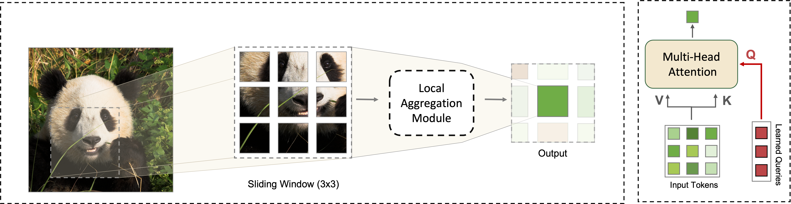

# Query-And-Attend: Learned Queries for Efficient Local Attention
#### Preprint available through this [link](https://arxiv.org/abs/2112.11435)

---
### Updates  (Feb. 11):

- Implementation of QnA layer and other components are available
- QnA-ViT and training code will be released later this month
  - Code went refactoring - under testing and reproducing results

---
### TODO list:
- [x] Initial release
- [ ] Models release & pretrained weights
- [ ] Full documentation
- [ ] Add colab 
